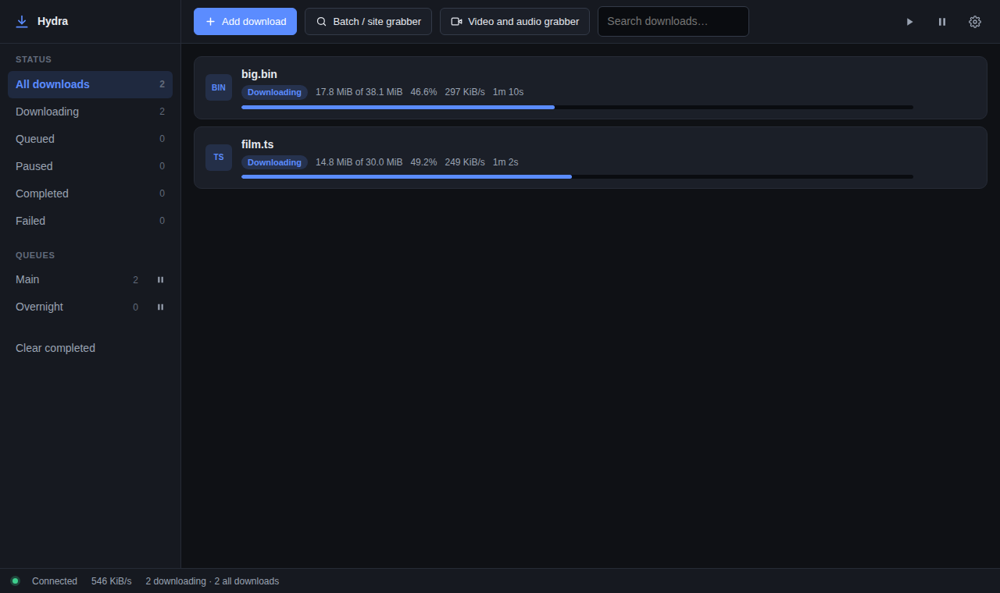
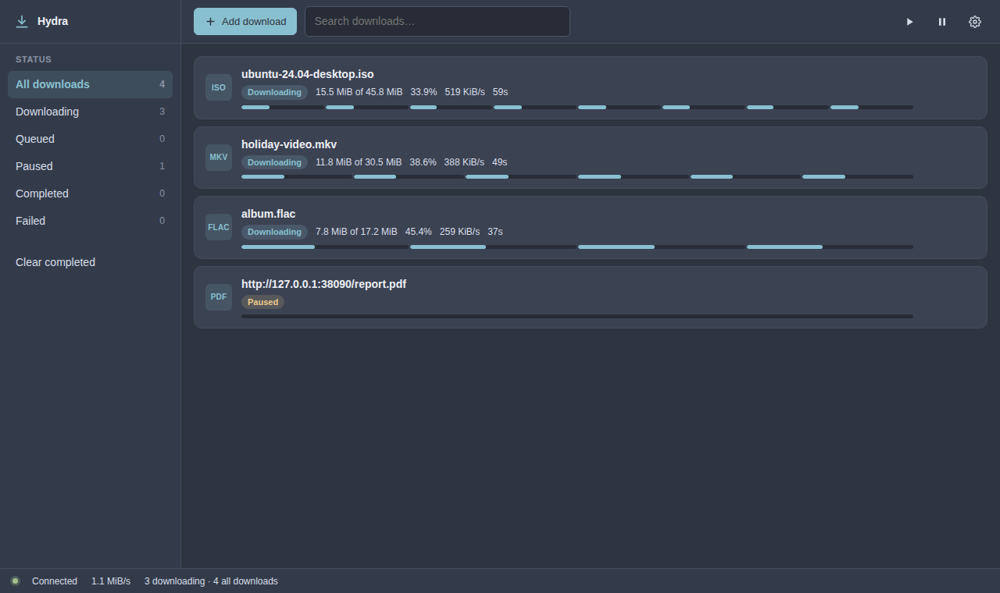
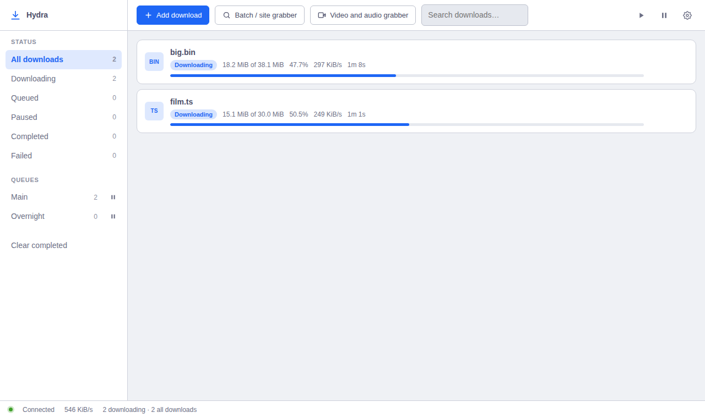
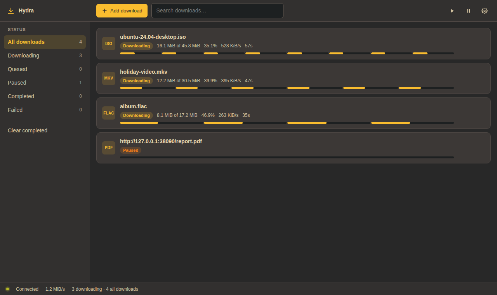
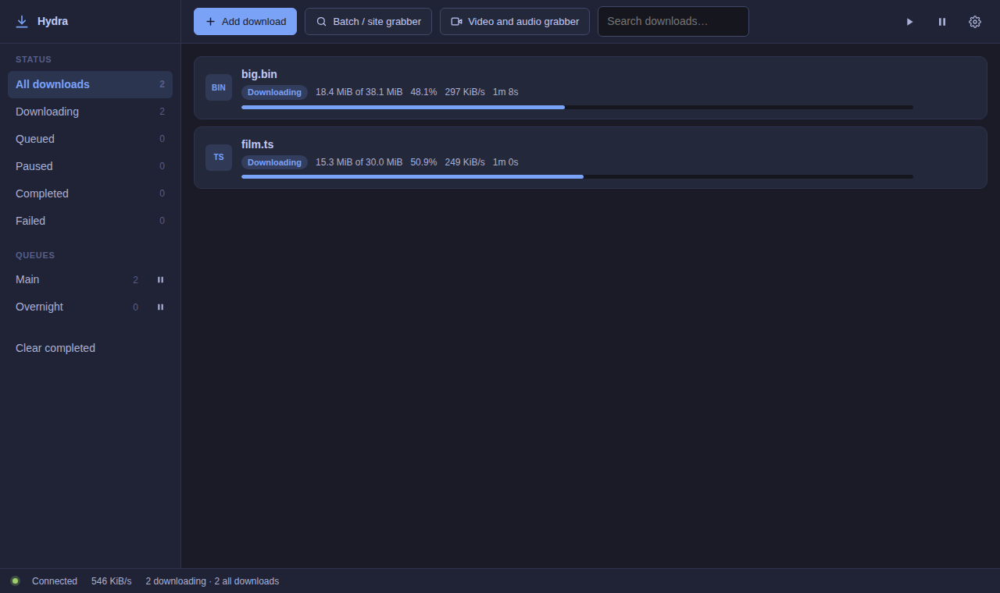
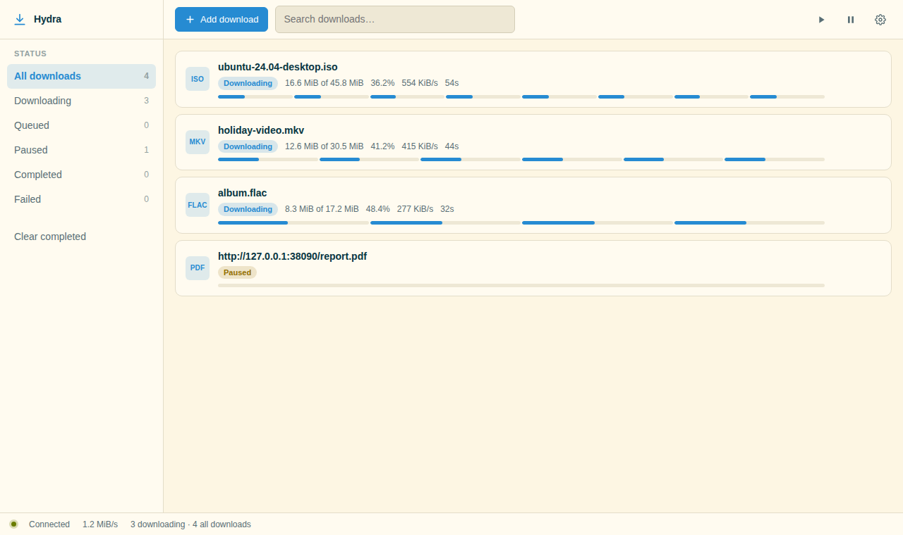
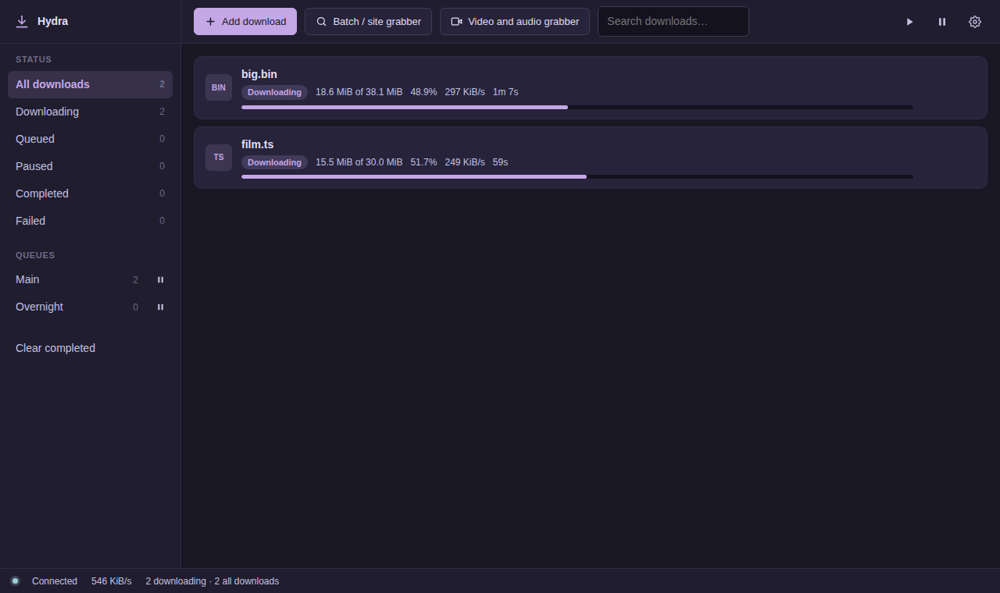
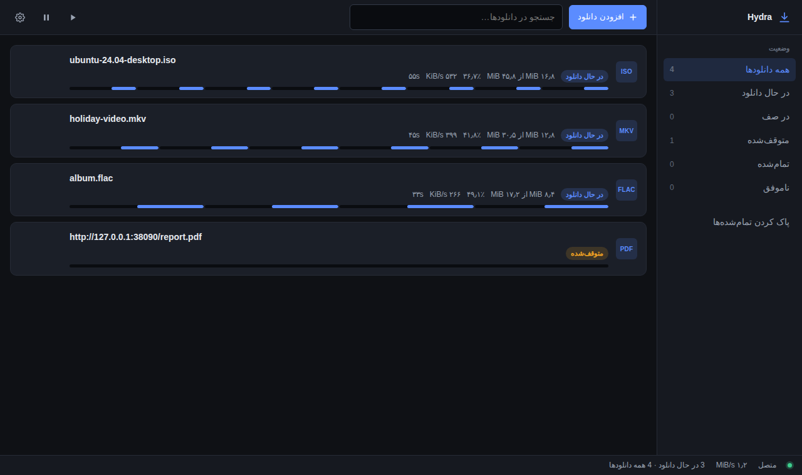

<div align="center">

# 🐉 Hydra Download Manager

**A modern, open-source replacement for Internet Download Manager.**

Many heads, one file. Segmented multi-connection downloading, resumable
transfers, queues and scheduling, browser capture, and an interface that does
not look like it was designed in 2005.

*No third-party dependencies. No adware. No licence key. No nag screens.*

</div>

---

## Why

Internet Download Manager has been the benchmark for download acceleration for
two decades, but it is closed-source, Windows-only, paid, and its interface has
barely changed since Windows XP.

Hydra matches it feature for feature while being open, cross-platform, and
pleasant to look at.

## What it looks like



Each download draws **one bar per connection**, so segmentation is something you
can watch rather than a claim on a feature list.

Twelve themes ship in the box:

| | | |
| --- | --- | --- |
|  |  |  |
| Nord | Catppuccin Latte | Gruvbox |
|  |  |  |
| Tokyo Night | Solarized Light | Rosé Pine |

And the whole interface flips for Persian — genuine right-to-left layout using
CSS logical properties, with filenames held left-to-right so they stay readable
and numbers localized:



## What it does

| | |
| --- | --- |
| ⚡ **Segmented downloads** | Up to 32 connections per file, and a connection that finishes early takes over the back half of the slowest one, so one slow peer cannot hold up the transfer |
| ⏯️ **Resume that is safe** | Survives crashes, reboots and network loss — and *refuses* to resume when the remote file changed, because splicing two versions together produces a file that passes every length check and fails only when you open it |
| 📅 **Queues and schedules** | Per-queue concurrency and speed caps, windows that wrap past midnight for overnight runs, and shutdown or sleep when a queue drains |
| 🎚️ **Speed limits** | Global, per-queue and per-download at once, all satisfied by nesting the buckets |
| 🌐 **Browser capture** | MV3 extensions for Chrome, Edge, Brave and Firefox, forwarding the cookies, referer and user-agent that make session-protected links work |
| 🕷️ **Site grabber** | Crawl a site with type and depth filters — honouring `robots.txt` — or expand `photo[001-250].jpg` in one go |
| 🔍 **Integrity** | MD5, SHA-1 and SHA-256 verified *before* the file is renamed into place |
| 🗂️ **Categories** | Documents, Music, Video, Programs, Compressed and Images, sorted automatically |
| 🎨 **Twelve themes** | Plus custom accent colours, and your own themes in two small edits |
| 🌍 **English and Persian** | With full right-to-left layout |
| 🧩 **Scriptable** | A REST and WebSocket API, a real CLI, and a Python plugin layer for site extractors |

Beyond IDM: a proper API, a real command line, headless server operation, all
three platforms, and a yt-dlp bridge that covers far more sites than IDM's own
grabber.

## Getting started

```sh
git clone https://github.com/neo-the-hammer/IDM
cd IDM
cargo build --release
./target/release/hdmd
```

Then open <http://127.0.0.1:47113/>.

Nothing to `npm install`, nothing to `pip install`. See
[`docs/BUILDING.md`](docs/BUILDING.md) for platform notes and
[`packaging/`](packaging/) for `.deb`, Windows and macOS packaging.

### From the command line

```sh
hdm get https://example.com/ubuntu.iso -n 16      # download now, no daemon
hdm add https://example.com/big.zip --limit 2M    # queue it
hdm batch 'https://example.com/photo[001-250].jpg' --add
hdm grab https://example.com/docs/ --depth 2 --include pdf --add
hdm list
```

### In the browser

Load [`extensions/chromium`](extensions/) unpacked, run
`packaging/native-host/install.sh "" <extension-id>`, and downloads start going
to Hydra automatically.

## Architecture

```
        browser ext (MV3)        web UI (TS+CSS)        hdm CLI
               │                       │                   │
        native host bridge         REST + WebSocket        │
               └───────────────┬───────┴───────────────────┘
                               ▼
                        hdm-daemon (hdmd)
                               │
 ┌─────────────────────────────┼──────────────────────────┐
 ▼                             ▼                          ▼
hdm-core                   hdm-api                 python plugin host
segments · resume        HTTP/1.1 + WS             links · media
queues · scheduler        token auth               yt-dlp bridge
 │
 ▼
hdm-net ── Transport ──┬── raw: TCP + TLS (OpenSSL)   [Linux, macOS]
                       └── winhttp: winhttp.dll       [Windows]
```

**Rust** does the network and the engine. **Python** is the extraction brain —
optional, and everything except the site grabber and media extraction works
without it. **TypeScript** is the face.

### Zero dependencies, on purpose

Hydra's Rust code has an **empty dependency tree**. No `tokio`, no `reqwest`, no
`openssl-sys`. Just the standard library plus hand-written FFI to TLS the
operating system already ships: OpenSSL 3 loaded at run time via `dlopen` on
Unix, WinHTTP on Windows.

A download manager is a security-sensitive network client that runs constantly
and talks to servers chosen by whoever sent you a link. An empty dependency tree
is the strongest supply-chain guarantee we can offer — and the whole `.deb`,
including all three binaries, the interface and the plugins, is about 610 KB.

## Status and honesty

Under active development. About 250 Rust tests and 24 Python ones, plus browser
checks that drive the real interface and the real extension in Chromium.

**The Windows code paths have never been compiled.** Hydra was developed in a
Linux container with no Windows Rust target available, so `transport::winhttp`
and `platform::windows` are written against documented APIs but unverified. They
are deliberately small and behind `#[cfg]` so they cannot affect the tested
paths, and [`docs/ROADMAP.md`](docs/ROADMAP.md) says so plainly. The first
Windows build is a real checkpoint — please report anything that breaks.

Deliberately out of scope: BitTorrent, which is a large project in its own right
and which IDM does not do either.

## Documentation

| | |
| --- | --- |
| [Building](docs/BUILDING.md) | Every platform, and the optional parts |
| [API](docs/API.md) | REST and WebSocket, with worked examples |
| [Theming](docs/THEMING.md) | Adding a theme or a language |
| [Extensions](extensions/README.md) | Browser capture, and what its permissions are for |
| [Plugins](python/README.md) | The extraction protocol |
| [Roadmap](docs/ROADMAP.md) | What is done, and what is known to be missing |

## Licence

Dual-licensed under [MIT](LICENSE-MIT) or [Apache 2.0](LICENSE-APACHE), at your
option.

---

<div align="center" dir="rtl">

## هایدرا — مدیر دانلود متن‌باز

جایگزینی مدرن و متن‌باز برای Internet Download Manager.

دانلود چنداتصاله با تقسیم‌بندی پویا، ازسرگیری مطمئن دانلودهای نیمه‌کاره،
صف و زمان‌بندی، یکپارچگی با مرورگر، و خزنده سایت.

رابط کاربری با **۱۲ پوسته آماده** و پشتیبانی کامل از **فارسی و چیدمان راست‌به‌چپ**
— نه ترجمه‌ای نیم‌بند، بلکه چیدمانی که واقعاً برعکس می‌شود، با اعداد فارسی و
نام فایل‌هایی که چپ‌به‌راست و خوانا می‌مانند.

**بدون هیچ وابستگی خارجی. بدون تبلیغات. بدون کرک و لایسنس.**

</div>
